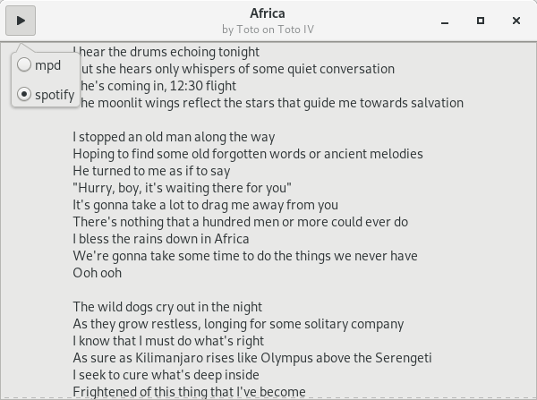

# Glyrics
A GTK+ lyrics viewer that uses [glyr](https://github.com/sahib/glyr) and [playerctl](https://github.com/acrisci/playerctl) for its back-end.

  

## Install
You can get flatpak builds from the releases page [here](https://github.com/aymanbagabas/Glyrics/releases).

## Todo
See TODO.

## Credit
* [sahib](https://github.com/sahib) for [libglyr](https://github.com/sahib/glyr) and [plyr](https://github.com/sahib/python-glyr).
* [acrisci](https://github.com/acrisci) for [playerctl](https://github.com/acrisci/playerctl) library.

## License
See COPYING.

Copyright © 2019, Ayman Bagabas
